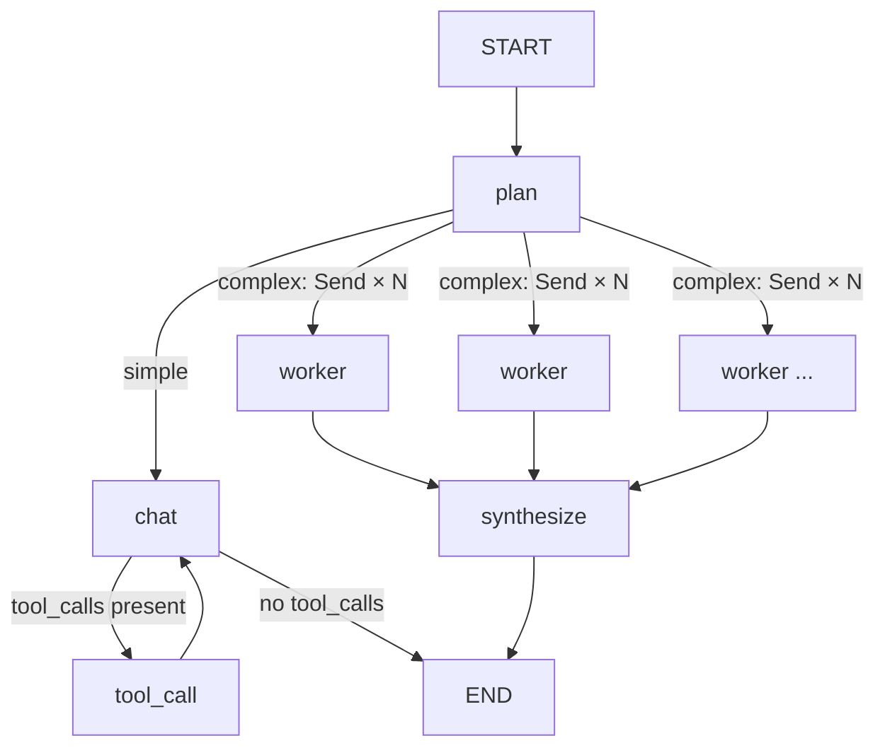

# Lead Agent + Swarm

## Overview

Every turn starts at a lead agent (`plan`) that classifies the incoming query as `simple` or `complex`:

- **Simple** (the common case) routes straight into the existing single-agent loop — same `chat ⇄ tool_call` behavior as before this feature existed.
- **Complex** decomposes the query into independent subtasks, fans them out to parallel **worker** agents via LangGraph's native `Send` API, then a **synthesis** step merges their findings into one final answer.

This exists because a single agent working through several unrelated lines of research inside one context window is slower and more prone to conflating them than researching each independently and combining the results.

```
app/core/langgraph/graph.py
  _plan        — lead agent: classifies + decomposes
  _chat        — unchanged single-agent node (also reused inside _worker)
  _tool_call   — unchanged tool-execution node (also reused inside _worker)
  _worker      — runs one subtask via a local _chat/_tool_call loop
  _synthesize  — combines all worker outputs into one answer

app/schemas/graph.py
  QueryPlan          — structured output from the lead agent
  GraphState.subtasks / subtask_results — new state fields
```

## Graph topology



| Node | Responsibility |
|---|---|
| `plan` | Lead agent. Cheap structured-output call classifies `simple`/`complex`; complex queries get decomposed into subtasks. |
| `chat` | Unchanged single-agent node — builds the system prompt, calls the LLM, routes to `tool_call` or `END`. |
| `tool_call` | Unchanged — executes all tool calls concurrently, feeds results back to `chat`. |
| `worker` | Runs one subtask to completion via a local loop, bounded by its own tool-call budget. |
| `synthesize` | Runs once all worker branches converge; combines their findings into one answer. |

## The lead agent (`_plan`)

Classifies the query using a fast, cheap model with structured output — the same idiom already used for session-title generation (`app/services/session_naming.py`):

```python
plan: QueryPlan = await self.llm_service.call(
    [SystemMessage(content=DECOMPOSITION_PROMPT), HumanMessage(content=user_query)],
    model_name="gpt-5.4-nano",
    response_format=QueryPlan,
    reasoning={"effort": "low"},
)
```

`QueryPlan` (`app/schemas/graph.py`):

```python
class QueryPlan(BaseModel):
    complexity: Literal["simple", "complex"]
    subtasks: list[str] = Field(default_factory=list)
```

The routing prompt (`app/core/prompts/decomposition.md`) is written to prefer `"simple"` when unsure, since decomposition adds latency and cost.

**Failure mode**: if the classification call itself fails (timeout, all models exhausted, etc.), `_plan` catches the exception and routes to `chat` anyway — decomposition failure never fails the whole request, it just means the query gets handled by one agent instead of a swarm.

For complex queries, subtasks are capped at `MAX_SUBTASKS` (default 4) and fanned out with LangGraph's dynamic parallel-branch primitive:

```python
return Command(
    update={"subtasks": subtasks},
    goto=[Send("worker", {"messages": [{"role": "user", "content": t}], "long_term_memory": state.long_term_memory}) for t in subtasks],
)
```

Each `Send` payload becomes the **input state** for one `worker` branch — fields not included (like `tool_call_count`) get `GraphState`'s normal defaults, so every worker starts clean, scoped only to its own subtask.

## Workers (`_worker`)

A worker is not a separate graph node implementation — it directly calls the existing `_chat` and `_tool_call` methods in a bounded local loop:

```python
local_state = state
while True:
    chat_command = await self._chat(
        local_state, config,
        allowed_tools=self._worker_tools,
        tool_call_limit=settings.MAX_TOOL_CALLS_PER_WORKER,
    )
    local_state.messages = add_messages(local_state.messages, chat_command.update["messages"])
    if chat_command.goto == END:
        break
    tool_command = await self._tool_call(local_state)
    local_state.messages = add_messages(local_state.messages, tool_command.update["messages"])
    local_state.tool_call_count = tool_command.update["tool_call_count"]

return Command(update={"subtask_results": [result_text]}, goto="synthesize")
```

This reuses every bit of `_chat`'s logic — skills, tool binding, retry/fallback, the tool-call cap mechanism — without duplicating it into a bespoke worker implementation. `add_messages` (the same reducer LangGraph applies internally to the `messages` channel) is called explicitly here because this loop runs outside the graph engine's normal node-return path, so nothing merges the message list automatically.

**Two things scope a worker down from the simple path:**

1. **Tools** — `self._worker_tools` is every tool except `ask_human`, computed once in `__init__`. Workers can't pause the whole swarm to ask the user something, because resuming a specific branch of a parallel `Send` fan-out is a known LangGraph sharp edge (which branch gets the answer?). This is enforced structurally, not defensively: the model is never given `ask_human`'s schema for worker calls, so it can't emit that tool call in the first place — same technique already used to enforce the tool-call cap in `_chat`.
2. **Tool-call budget** — `MAX_TOOL_CALLS_PER_WORKER` (default 3) instead of the simple path's `MAX_TOOL_CALLS_PER_TURN` (default 5), since a complex turn can run several workers concurrently and their cost compounds.

This required one change to the LLM service layer: `LLMService.call()` (`app/services/llm/service.py`) gained an optional `tools` parameter that binds a custom tool list for a single call, without touching the shared default-bound model (`self._llm`). It flows through the same fallback/retry loop already used for `model_name`/`response_format` overrides — `tools=None` (the default) leaves every existing call site unchanged.

## Synthesis (`_synthesize`)

Runs once all worker branches converge (LangGraph waits for every `Send`-spawned branch before advancing). `subtask_results` — a `GraphState` field annotated `Annotated[list[str], operator.add]` — has already been merged across the parallel writes by the time this node runs:

```python
findings = "\n\n".join(f"Finding {i + 1}: {r}" for i, r in enumerate(state.subtask_results))
```

That combined text plus the original query goes through one more `llm_service.call`, producing the final `AIMessage` the same way `_chat` does — so downstream code (`get_response`/`get_stream_response`, message history, memory) treats a synthesized answer identically to a simple-path answer; no special-casing needed.

## Streaming behavior

Only the final answer streams to the client — worker execution and the lead agent's classification happen server-side. `get_stream_response` filters `graph.astream(..., stream_mode="messages")` on the per-chunk metadata:

```python
if metadata.get("langgraph_node") not in ("chat", "synthesize"):
    continue
```

This works because LangGraph tags every streamed token with whichever node is currently executing — including tokens from `_chat`/`_tool_call` calls made *inside* `_worker`'s function body, which are tagged `"worker"`, not `"chat"`. No custom event type was needed to get "only stream the final answer" — it falls out of a field LangGraph already provides.

## Configuration

| Setting | Default | Purpose |
|---|---|---|
| `MAX_SUBTASKS` | `4` | Caps how many parallel workers a single complex query can spawn. |
| `MAX_TOOL_CALLS_PER_WORKER` | `3` | Tool-call rounds allowed per worker before it's forced to answer with what it has. |
| `MAX_TOOL_CALLS_PER_TURN` | `5` | Same mechanism, applied to the simple path's `chat` node. |

## What's deliberately out of scope (v1)

- **`ask_human` inside a swarm.** Interrupting one branch of a parallel fan-out and knowing which branch to resume is unresolved for now — `ask_human` only exists on the simple path.
- **Sequential/dependent subtasks.** The decomposition prompt is written to only split queries into *independent* subtasks; workers never see each other's results mid-flight, only after `synthesize` combines them.
- **Streaming worker progress.** Clients see nothing until the final answer starts streaming — no "searching: &lt;subtask&gt;" progress events.

## Verification

- `make lint` / `make typecheck`.
- `make dev`, send a simple query (e.g. "what's 2+2") via `/chat` — logs show `query_routed_simple`, no `worker_completed` entries, response unchanged from the pre-swarm behavior.
- Send a genuinely multi-part query (e.g. "compare the current weather in Tokyo, London, and New York and tell me which is warmest") — logs show `query_routed_complex` with a `subtask_count`, one `worker_completed` per subtask, then `swarm_synthesis_completed`.
- Same complex query via `/chat/stream` — confirm via raw SSE output that only synthesis tokens stream, no worker/plan token leakage mid-turn.
- Check a Langfuse trace for a complex turn to see `plan` → parallel `worker` branches → `synthesize` as distinct spans (tracing needs no extra wiring — `llm_inference_duration_seconds` and the Langfuse callback list already flow through every node via `config`).
