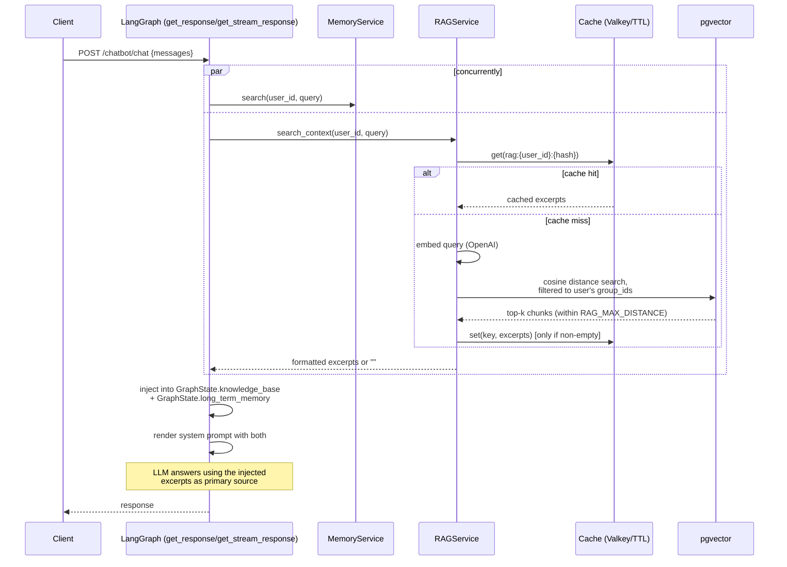
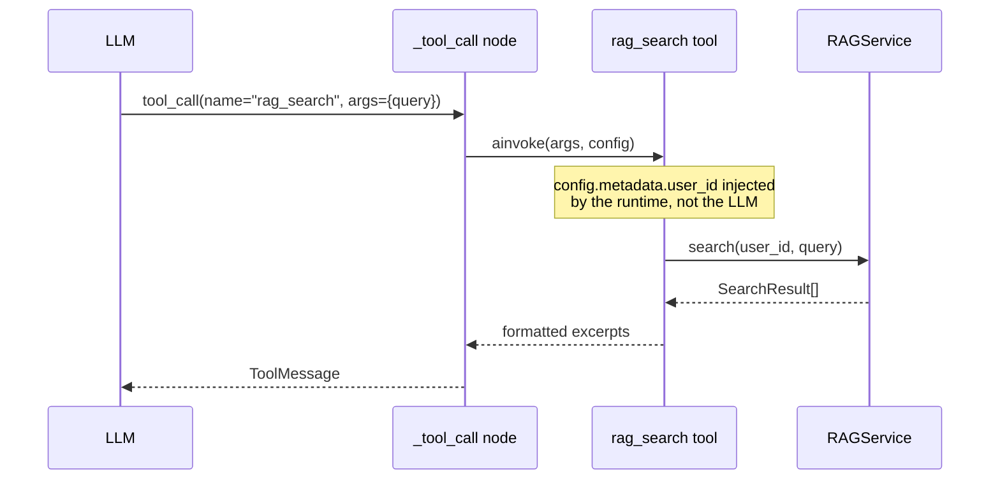
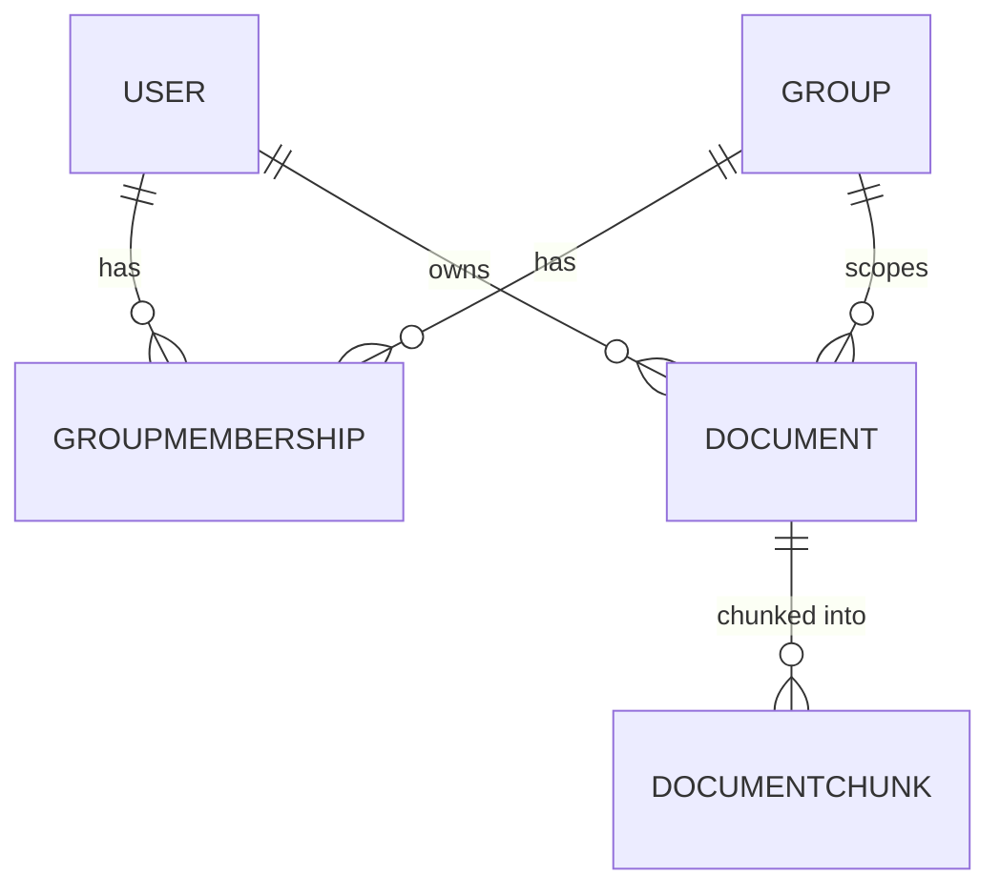
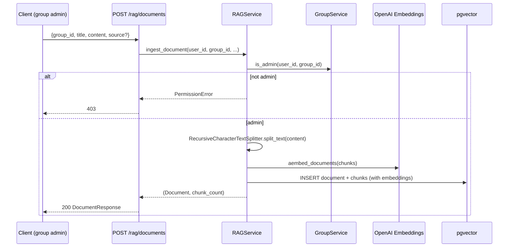

# RAG (Retrieval-Augmented Generation)

## Overview

The knowledge base lets users ingest their own documents and have the agent ground its answers in them instead of guessing or reaching for web search. Documents are chunked, embedded with OpenAI embeddings, and stored in PostgreSQL via pgvector. Retrieval is **automatic**: every chat turn searches the knowledge base up front, alongside long-term memory, and the results are injected straight into the system prompt — the model doesn't have to decide to look things up.

Access control is **group-based**: every document belongs to exactly one group, and a user can only search documents in groups they're a member of. Group **admins** can ingest and delete documents and manage membership; **members** can only search/read. Access is always resolved server-side from the authenticated session — never from request bodies or LLM-supplied IDs.

## How retrieval works (automatic, per chat turn)



The system prompt (`app/core/prompts/system.md`) has a dedicated `# Knowledge Base` section that renders `{knowledge_base}` directly — not just a tool description — with explicit instructions to the model:

- If the excerpts answer the question, use them as the primary source and cite the document title. Don't fall back to web search or general knowledge, and don't guess.
- If they say nothing relevant was found, or don't fully answer it, the model may call the `rag_search` tool itself with a different query before reaching for web search.

This mirrors exactly how long-term memory (`{long_term_memory}`) is surfaced, so both are consistent from the model's point of view.

## The `rag_search` tool (follow-up digging)

The automatic per-turn search only covers the user's latest message. `rag_search` stays available as a bindable tool so the model can issue additional, differently-worded queries within the same turn (e.g. after the first excerpts turn out to be adjacent but not quite right).

Access control for the tool is enforced the same way as everywhere else: `user_id` is read from `RunnableConfig` (injected automatically by LangChain/LangGraph — excluded from the tool's schema, so the LLM can never see or override it), never from a tool argument.



## Access control model

Role/group-based, enforced in `app/services/group.py` and `app/services/rag.py`:

- **Group** — the access-control boundary. Every `Document` belongs to exactly one group.
- **GroupMembership** — links a user to a group with a `role`: `"admin"` or `"member"`.
  - `admin`: can ingest and delete documents in the group, add/remove members, change roles.
  - `member`: can search/read documents in the group. Cannot ingest, delete, or manage membership.
- Document deletion is also allowed for the document's **owner** (the user who uploaded it), even without an admin role.
- `RAGService.search()` resolves the caller's accessible `group_id`s server-side (`GroupService.user_group_ids`) and filters every query to that set. Requesting a `group_id` the caller isn't a member of silently returns no results, rather than leaking whether the group exists.
- Creating a group makes the creator its first admin.



## Ingestion



Chunking uses `langchain_text_splitters.RecursiveCharacterTextSplitter` with `RAG_CHUNK_SIZE`/`RAG_CHUNK_OVERLAP`. Embedding calls (both ingestion and query-time) are wrapped in the same `tenacity` retry policy (exponential backoff, `MAX_LLM_CALL_RETRIES` attempts) used by the main LLM service.

## Endpoints

All endpoints require a user token (`Depends(get_current_user)`, same as `/auth/sessions`) and are rate-limited.

### Groups — `app/api/v1/groups.py`

| Method & path | Who | Description |
| --- | --- | --- |
| `POST /api/v1/rag/groups` | any user | Create a group; creator becomes its first admin |
| `GET /api/v1/rag/groups` | any user | List groups the caller belongs to, with their role in each |
| `GET /api/v1/rag/groups/{group_id}/members` | group member | List a group's members |
| `POST /api/v1/rag/groups/{group_id}/members` | group admin | Add/update a member by email + role |
| `DELETE /api/v1/rag/groups/{group_id}/members/{user_id}` | group admin | Remove a member |

```bash
curl -X POST /api/v1/rag/groups \
  -H "Authorization: Bearer <user token>" \
  -H "Content-Type: application/json" \
  -d '{"name": "engineering"}'

curl -X POST /api/v1/rag/groups/1/members \
  -H "Authorization: Bearer <user token>" \
  -H "Content-Type: application/json" \
  -d '{"email": "teammate@example.com", "role": "member"}'
```

### Documents — `app/api/v1/documents.py`

| Method & path | Who | Description |
| --- | --- | --- |
| `POST /api/v1/rag/documents` | group admin | Chunk, embed, and store a document |
| `GET /api/v1/rag/documents` | any user | List documents in groups the caller belongs to |
| `DELETE /api/v1/rag/documents/{document_id}` | owner or group admin | Delete a document and its chunks |
| `POST /api/v1/rag/documents/search` | any group member | Direct knowledge-base search (outside chat) |

```bash
curl -X POST /api/v1/rag/documents \
  -H "Authorization: Bearer <user token>" \
  -H "Content-Type: application/json" \
  -d '{"group_id": 1, "title": "Onboarding Guide", "content": "...", "source": "onboarding.pdf"}'

curl -X POST /api/v1/rag/documents/search \
  -H "Authorization: Bearer <user token>" \
  -H "Content-Type: application/json" \
  -d '{"query": "how do I request PTO", "top_k": 5}'
```

Note: chat itself never calls `/rag/documents/search` — that endpoint exists for direct/manual querying and debugging. The chat path calls `RAGService.search_context()` in-process (see the sequence diagram above).

## Cache layer

`RAGService.search_context()` (used by the automatic per-turn retrieval) caches formatted results the same way `MemoryService.search()` does:

- Cache key: `rag:{user_id}:{sha256(query)[:16]}`
- TTL: `CACHE_TTL_SECONDS` (default: 60s)
- Only **non-empty** results are cached — a miss (nothing relevant found) is never cached, so a newly-ingested document becomes searchable on the next request rather than being masked by a stale empty-result cache entry.
- Uses the same Valkey/Redis-or-in-memory `cache_service` as memory search.

## Data model

- `Group` (`app/models/group.py`) — `id`, `name` (unique)
- `GroupMembership` — `user_id`, `group_id`, `role` (`admin`/`member`), unique on `(user_id, group_id)`
- `Document` (`app/models/document.py`) — `id` (UUID), `group_id`, `owner_id`, `title`, `source`
- `DocumentChunk` — `document_id`, `chunk_index`, `content`, `embedding` (`pgvector.sqlalchemy.Vector`)

Chunks cascade-delete with their document (both at the ORM relationship level and via `ON DELETE CASCADE` in the migration). Similarity search uses an `ivfflat` cosine index (`vector_cosine_ops`) on `documentchunk.embedding`.

Migration: `alembic/versions/f3a9c7e21b6d_add_rag_group_and_document_tables.py`. Run `make migrate` to apply it (creates the `vector` extension if it isn't already enabled — it usually is, since mem0 also depends on it).

## Configuration

| Variable | Default | Description |
| --- | --- | --- |
| `RAG_EMBEDDER_MODEL` | `text-embedding-3-small` | Embedding model for chunks and queries |
| `RAG_EMBEDDING_DIMENSIONS` | `1536` | Must match the embedder's output size; changing the model requires a migration to resize the pgvector column |
| `RAG_CHUNK_SIZE` | `1000` | Characters per chunk |
| `RAG_CHUNK_OVERLAP` | `150` | Character overlap between consecutive chunks |
| `RAG_TOP_K` | `5` | Max chunks returned per search |
| `RAG_MAX_DISTANCE` | `0.5` | Cosine distance cutoff (0 = identical, 2 = opposite); hits farther than this are dropped |

Rate limits (`app/core/config.py` → `RATE_LIMIT_ENDPOINTS`): `documents` (20/min), `documents_search` (30/min), `groups` (20/min).

## Design notes / trade-offs

- **Automatic retrieval runs on every chat turn**, even for users with no groups (it short-circuits to `""` quickly, and is cached per user+query). This adds one embedding call + pgvector query to the hot path. If that latency becomes a problem, consider gating it behind message length or the existing query-decomposition classifier — not done yet since it hasn't shown up as a bottleneck.
- **Never trust LLM- or request-supplied identity for access control.** Every access decision — chat-time retrieval, the `rag_search` tool, and the REST endpoints — resolves `user_id` from the authenticated session (JWT → `get_current_user`/`get_current_session`, or `RunnableConfig.metadata.user_id` for the tool), never from a request body field or a tool argument the model could set.
- **Group membership, not document-level ACLs.** Simpler to reason about and administer than per-document sharing; the trade-off is that access grants at the group granularity, not per-document.
