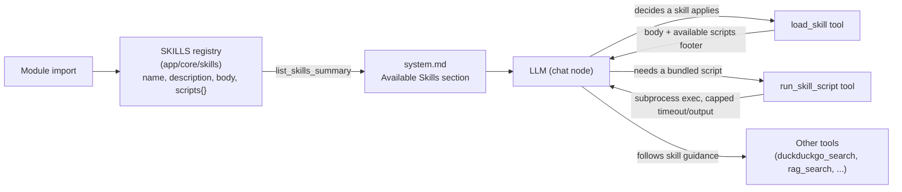

# Skills

## Overview

Skills separate two concerns that used to live in one place: **tools** (`app/core/langgraph/tools/`) are raw function calls the LLM can invoke — thin, mechanical, no judgment baked in. **Skills** (`app/core/skills/`) are markdown-defined procedures describing *when and how* to use those tools well for a class of task. Skills are not always-on: the agent loads one into context on demand via a `load_skill` tool call, rather than every instruction living permanently in `system.md`.

Some skills also bundle **scripts** — Python programs for work an LLM shouldn't do in its head (exact counting, deterministic data processing, calling out to a library). These run through a separate `run_skill_script` tool, which can only execute scripts that are physically present in that skill's own `scripts/` directory — never an arbitrary path or shell command.

This mirrors Claude Code's own Skill model: a short always-visible listing (name + one-liner) lets the model decide *if* a skill applies; the full instructions — and any bundled scripts — only enter context/execute when it does.

```
app/core/skills/
  __init__.py                  # registry: scans skill directories at import time
  web_research/
    SKILL.md                    # instructions only, no scripts
  text_stats/
    SKILL.md                    # instructions + how to call the script
    scripts/
      text_stats.py              # runnable via run_skill_script

app/core/langgraph/tools/
  load_skill.py                 # tool: pulls a skill's SKILL.md body into context
  run_skill_script.py           # tool: executes one of a skill's bundled scripts
```

## Skill directory format

Each skill is a **directory** named after the skill, containing a `SKILL.md` with `---`-delimited frontmatter followed by the instruction body, and optionally a `scripts/` subdirectory:

```markdown
---
name: text_stats
description: Use when the user asks for exact word/character/sentence counts or reading time. Don't estimate these yourself — run the script.
---

# Text Stats

Computing exact counts by reading through text yourself is unreliable...

## Steps
1. Call `run_skill_script` with `skill_name="text_stats"`, `script_name="text_stats.py"`, `script_args=["<text>"]`.
2. Report the numbers from its JSON output directly.
```

- `name` — the exact string the LLM passes to `load_skill(skill_name=...)` and `run_skill_script(skill_name=...)`.
- `description` — one line, shown in the system prompt so the model can decide whether the skill applies. Keep it specific enough to trigger on the right requests and skip the rest.
- Everything after the closing `---` is the skill body, returned verbatim as `load_skill`'s output. **If the skill has scripts, the body must tell the model the exact script name, what arguments it expects, and how to interpret its output** — the model never sees the scripts directory itself, only what the body and the registry-generated footer (see below) tell it.

Parsing is intentionally minimal (`app/core/skills/__init__.py`) — no YAML dependency, just a split on `---` and `key: value` lines for the two frontmatter fields.

## Bundled scripts

Any `.py` file placed under a skill's `scripts/` directory is automatically discovered at import time — **no frontmatter declaration needed**, presence is enough. This keeps the parser simple and means a script can't be "declared" without actually being there.

```
app/core/skills/text_stats/
  SKILL.md
  scripts/
    text_stats.py
```

```python
# scripts/text_stats.py
# Usage: python text_stats.py "<text to analyze>"
# Prints a JSON object to stdout.
```

Scripts should:
- Take input via `sys.argv`, not stdin (simpler to invoke, easier to reason about from the tool call).
- Print a single result to stdout — ideally JSON, so the model can parse it reliably.
- Exit non-zero with a stderr message on failure; the tool surfaces that back to the model verbatim.
- Not require network/filesystem access beyond what a short-lived, sandboxed script should need — there's no additional sandboxing beyond the subprocess boundary and the execution timeout (see below).

## How it's wired



1. **Registry load** (`app/core/skills/__init__.py`) — at import time, every subdirectory of `app/core/skills/` containing a `SKILL.md` is parsed into a `SkillDefinition` (Pydantic model: `name`, `description`, `body`, `scripts: dict[str, Path]`) and cached in `SKILLS: dict[str, SkillDefinition]`. `scripts` is built by globbing that skill's `scripts/*.py` — the *only* set of paths `run_skill_script` will ever execute. Logged once via `skills_loaded` (including which skills have scripts).
2. **Prompt injection** (`app/core/prompts/__init__.py`) — `load_system_prompt()` calls `list_skills_summary()` and fills the `{available_skills}` placeholder in `system.md` automatically. Callers (`LangGraphAgent._chat`) don't need to pass anything extra.
3. **Dispatch** — the LLM sees the skill listing in its system prompt and, when a request matches, calls `load_skill(skill_name="text_stats")` like any other tool call. It's registered in `app/core/langgraph/tools/__init__.py` alongside the rest of `tools`, so it flows through the existing generic tool dispatch in `LangGraphAgent._tool_call` — no graph changes needed.
4. **Result** — `load_skill` returns the skill's `body`, and — if the skill has any bundled scripts — appends a generated footer listing their exact filenames, so the model never has to guess a script name:
   ```
   ---
   Available scripts for this skill (run via run_skill_script(skill_name="text_stats", script_name=...)): text_stats.py
   ```
5. **Script execution** — if the skill's instructions call for it, the model calls `run_skill_script(skill_name=..., script_name=..., script_args=[...])`. The tool looks up `script_name` in that skill's pre-built `scripts` dict (rejecting anything that isn't an exact match — no path is ever constructed from LLM input), then runs it as `sys.executable <path> <script_args...>` via `asyncio.create_subprocess_exec` (never through a shell, so no shell-injection surface). Stdout is returned as the tool result; a non-zero exit returns the script's stderr instead of a raw traceback.

## Script execution limits

| Control | Setting | Default | Behavior |
| --- | --- | --- | --- |
| Timeout | `SKILL_SCRIPT_TIMEOUT_SECONDS` | `30` | Process is killed and a timeout message is returned if it runs longer than this. |
| Output cap | `SKILL_SCRIPT_MAX_OUTPUT_CHARS` | `4000` | Stdout is truncated (with a `[output truncated]` marker) beyond this length, so a runaway script can't blow up the context window. |

Scripts run with the same OS-level permissions as the API process itself — there is no additional sandbox (no container, no restricted user). Only add scripts you'd be comfortable running as part of the application; this is not a safe place to execute untrusted or user-authored code.

## Security model

- **The set of runnable programs is fixed at deploy time**, not chosen by the LLM or end user. `run_skill_script` only ever executes a path that was discovered on disk under a skill's `scripts/` directory when the registry loaded — `script_name` is looked up in that pre-built dict, never concatenated into a path.
- **No shell involved.** Execution goes through `asyncio.create_subprocess_exec` with an argv list (`[sys.executable, script_path, *script_args]`), not `shell=True` or string interpolation — so special characters in `script_args` can't be used to chain additional commands.
- **The LLM only controls the script's own arguments**, exactly the same trust boundary as any other tool input (e.g. a `rag_search` query or `duckduckgo_search_tool` query) — the program being run is not attacker/LLM-influenced, only its input is.
- **Bounded blast radius.** A timeout prevents a runaway or hung script from blocking a turn indefinitely, and an output cap prevents a verbose or malfunctioning script from flooding the context window.

## Interaction with the tool-call limit

`MAX_TOOL_CALLS_PER_TURN` (see [docs/configuration.md](configuration.md)) counts every round through the `tool_call` node — `load_skill` and `run_skill_script` calls each count the same as any other tool call. At the default of 5, that's roughly 1 round to load a skill, 1 round to run its script, plus up to 3 more rounds of tool use before the agent is forced to answer with what it has. No special-casing is needed; it's just a budget line worth remembering when writing skill content that expects several tool rounds.

## Adding a new skill

1. Create `app/core/skills/<name>/SKILL.md` with `name`/`description` frontmatter and the instruction body.
2. If the skill needs a script, add it under `app/core/skills/<name>/scripts/<script>.py`, and document in the SKILL.md body exactly how to call it (script name, expected arguments, what the output looks like) — `run_skill_script` executes it, but the model only knows how to *use* it from what the body says.
3. Restart the app (skills are read once at import time, not per-request).
4. Write the `description` to be decisive — it's the *only* thing the model sees before deciding to load the skill, so it needs to clearly signal when the skill does and doesn't apply.

No other code changes needed — the registry, both tools, prompt injection, and dispatch are all generic over whatever is in `app/core/skills/`.
