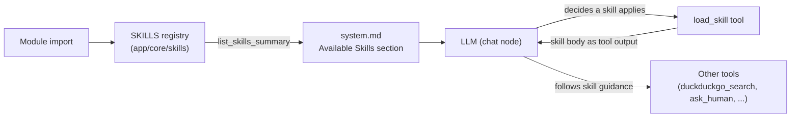

# Skills

## Overview

Skills separate two concerns that used to live in one place: **tools** (`app/core/langgraph/tools/`) are raw function calls the LLM can invoke — thin, mechanical, no judgment baked in. **Skills** (`app/core/skills/`) are markdown-defined procedures describing *when and how* to use those tools well for a class of task. Skills are not always-on: the agent loads one into context on demand via a `load_skill` tool call, rather than every instruction living permanently in `system.md`.

This mirrors Claude Code's own Skill model: a short always-visible listing (name + one-liner) lets the model decide *if* a skill applies; the full instructions only enter context when it does.

```
app/core/skills/
  __init__.py          # registry: parses *.md files at import time
  web_research.md       # example skill

app/core/langgraph/tools/
  load_skill.py          # tool the LLM calls to pull a skill's body into context
```

## Skill file format

Each skill is a single `.md` file with `---`-delimited frontmatter followed by the instruction body:

```markdown
---
name: web_research
description: Use when the user asks something needing current facts, news, prices, or other information you shouldn't answer from memory alone.
---

# Web Research

Use the `duckduckgo_search_tool` to find current information rather than
answering from memory when the question is time-sensitive.

## Steps
1. Break the question into concise search queries.
2. ...
```

- `name` — the exact string the LLM passes to `load_skill(skill_name=...)`.
- `description` — one line, shown in the system prompt so the model can decide whether the skill applies. Keep it specific enough to trigger on the right requests and skip the rest.
- Everything after the closing `---` is the skill body, returned verbatim as the tool's output when loaded.

Parsing is intentionally minimal (`app/core/skills/__init__.py`) — no YAML dependency, just a split on `---` and `key: value` lines for the two frontmatter fields.

## How it's wired



1. **Registry load** (`app/core/skills/__init__.py`) — at import time, every `*.md` file in the directory is parsed into a `SkillDefinition` (Pydantic model: `name`, `description`, `body`) and cached in `SKILLS: dict[str, SkillDefinition]`. Logged once via `skills_loaded`.
2. **Prompt injection** (`app/core/prompts/__init__.py`) — `load_system_prompt()` calls `list_skills_summary()` and fills the `{available_skills}` placeholder in `system.md` automatically. Callers (`LangGraphAgent._chat`) don't need to pass anything extra.
3. **Dispatch** — the LLM sees the skill listing in its system prompt and, when a request matches, calls `load_skill(skill_name="web_research")` like any other tool call. It's registered in `app/core/langgraph/tools/__init__.py` alongside the rest of `tools`, so it flows through the existing generic tool dispatch in `LangGraphAgent._tool_call` — no graph changes needed.
4. **Result** — `load_skill` returns the skill's `body` as a `ToolMessage`. That text now lives in the conversation history for the rest of the turn, steering how the model uses `duckduckgo_search_tool` (or whatever tools the skill references) before it answers.

## Interaction with the tool-call limit

`MAX_TOOL_CALLS_PER_TURN` (see [docs/configuration.md](configuration.md)) counts every round through the `tool_call` node — a `load_skill` call counts the same as any other tool call. At the default of 5, that's roughly 1 round to load a skill plus up to 4 rounds of actual tool use before the agent is forced to answer with what it has. No special-casing is needed; it's just a budget line worth remembering when writing skill content that expects several tool rounds.

## Adding a new skill

1. Create `app/core/skills/<name>.md` with `name`/`description` frontmatter and the instruction body.
2. Restart the app (skills are read once at import time, not per-request).
3. Write the `description` to be decisive — it's the *only* thing the model sees before deciding to load the skill, so it needs to clearly signal when the skill does and doesn't apply.

No other code changes needed — the tool, prompt injection, and dispatch are all generic over whatever is in `app/core/skills/`.
