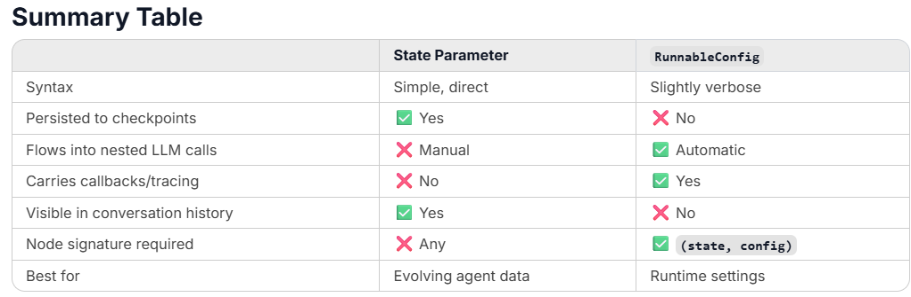

# Summary

## when to use State vs RunnableConfig

- limit max recursively call of LLM 
  - State["max_iteramtion]
  - RunnableConfig 

- State 
  - add to GraphState as a field 

- RunnableConfig
  - Create Node [create node](#langgraph-node-does-not-accept-extra-args)
    - Node signature 
  - Save Checkpointer space [save checkpointer](#save-checkpointer-space)
    - only save needed 
    - config is only injected during runtime 
  - **Per UserID/Session** [per user](#checkpointer-per-user--thread)
    




```markdown
Is it data that changes during the run?
    → State (messages, steps, results)

Is it sensitive / shouldn't be persisted?
    → RunnableConfig

Does it need to reach nested LLM/tool calls automatically?
    → RunnableConfig

Is it a per-user/per-thread/per-session setting?
    → RunnableConfig configurable

Is it simple and self-contained to the graph?
    → State is fine
```


### use state
```python
# Just put it in state — totally valid
class AgentState(TypedDict):
    messages: Annotated[list[BaseMessage], add_messages]
    steps: int
    max_iterations: int  # just a normal value

def call_model(state: AgentState):
    if state["steps"] >= state["max_iterations"]:  # just read it
        ...
```

### LangGraph node does not accept extra args
```python
# ❌ This won't work as a LangGraph node
def call_model(state, max_iterations=10, user_id=None):
    ...

# ✅ Config is the only official "second argument" slot
def call_model(state: AgentState, config: RunnableConfig):
    max_iterations = config["configurable"].get("max_iterations", 10)
    user_id = config["configurable"].get("user_id")
    ...
```

### save checkpointer space
```python
# State gets saved to every checkpoint — bad for large/sensitive config
class AgentState(TypedDict):
    messages: ...
    steps: int
    api_key: str        # ❌ saved to DB/checkpoint history
    tenant_config: dict # ❌ bloats every snapshot
    feature_flags: dict # ❌ shouldn't be in conversation history

# Config is runtime-only — never persisted
app.invoke(
    {"messages": [...], "steps": 0},  # lean state
    config={"configurable": {
        "api_key": "...",        # ✅ runtime only
        "tenant_config": {...},  # ✅ not stored
        "feature_flags": {...},  # ✅ not stored
    }}
)
```

### checkpointer per user / thread
```python
from langgraph.checkpoint.sqlite import SqliteSaver

checkpointer = SqliteSaver.from_conn_string(":memory:")
app = graph.compile(checkpointer=checkpointer)

# thread_id and user_id are configurable conventions
# that integrate with the checkpointer
app.invoke(
    {"messages": [HumanMessage("hello")]},
    config={
        "configurable": {
            "thread_id": "user-123-session-456",  # resume this conversation
            "user_id": "user-123",
            "max_iterations": 10
        }
    }
)
```