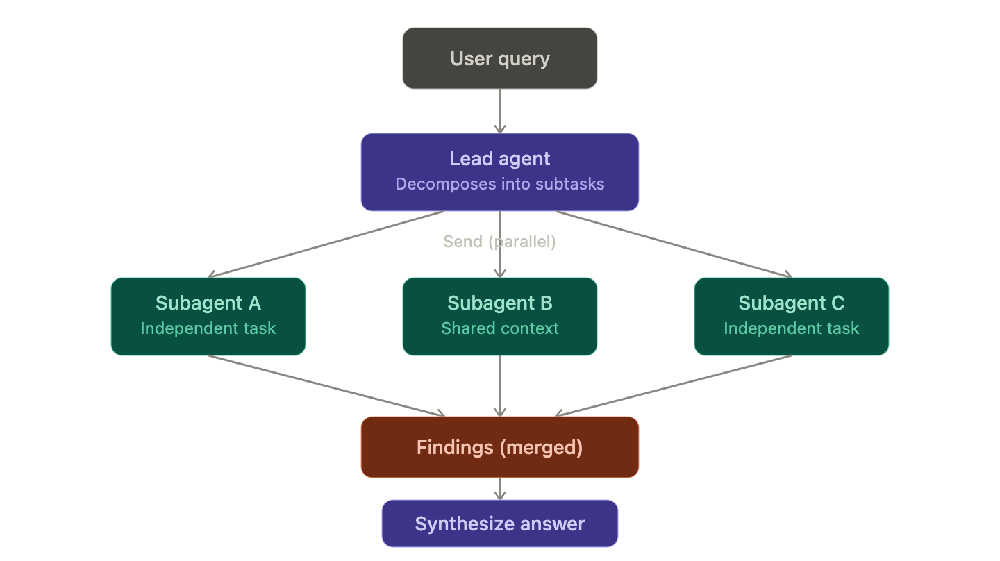

# Summary

## how to fire subagent concurrently 
 - core design [design](#design-)
   - one lead agent decompose the question 
     - 1 agent need -> use single agent 
     - gt 2 agent -> orchestrator-worker
       - lead assign subtasks 
       - Langgraph Send handles concurrent and fan-out subagent tasks
         - no asyncio.gather required 


### example for send 
```python
And the pseudocode for the lead agent's decompose step:

```python
async def lead_agent_decompose(state: SharedState) -> dict:
    """
    Lead agent node: reads the original query, produces a list of
    independent (or dependency-tagged) subtasks for fan-out.
    """
    prompt = f"""
    You are decomposing a user question into subtasks for specialist agents.

    Question: {state['original_query']}

    Return a JSON list of subtasks. For each subtask, specify:
    - id: short identifier
    - description: what this subagent should do
    - depends_on: list of subtask ids it needs results from (empty if independent)
    - agent_type: which specialist handles this (e.g. "sql_agent", "pandas_agent")
    """

    response = await strong_model.ainvoke(prompt)  # e.g. Claude Sonnet
    subtasks = parse_json(response)  # validate against a Pydantic schema

    # split into independent (parallelizable) vs dependent (sequential) batches
    independent = [t for t in subtasks if not t["depends_on"]]
    dependent   = [t for t in subtasks if t["depends_on"]]

    return {
        "subtasks": subtasks,
        "independent_batch": independent,
        "dependent_batch": dependent,
    }


def route_subtasks(state: SharedState):
    # fan out only the independent ones in this super-step
    return [
        Send(task["agent_type"], {"subtask": task, "original_query": state["original_query"]})
        for task in state["independent_batch"]
    ]
```

Key design point baked in: the lead agent doesn't just decompose — it also tags dependencies, so `route_subtasks` knows what's safe to `Send` in parallel versus what has to wait for a prior subagent's output. That's the piece that keeps you from accidentally racing dependent subtasks against each other.

### design 


