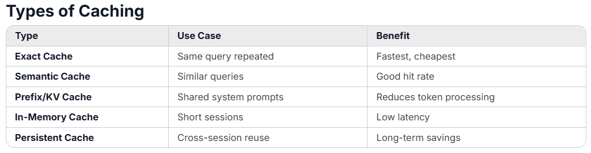

# Summary

## use case
- prefix cache -> provide by LLM Provider 
  - system prompt
- Exact match cache
  - in Memory 
  - Redis 
    - Cross Session
```text
Request
   │
   ▼
┌─────────────────────────────┐
│   L1: In-Memory Cache       │  ← Hot queries, sub-ms
│   (last 100-500 requests)   │
└────────────┬────────────────┘
             │ MISS
             ▼
┌─────────────────────────────┐
│   L2: Redis Exact Cache     │  ← Warm queries, ~1ms
│   (TTL: 1h - 24h)           │
└────────────┬────────────────┘
             │ MISS
             ▼
┌─────────────────────────────┐
│   L3: LLM API               │  ← With prefix caching
│   (OpenAI / Anthropic)      │     enabled automatically
└─────────────────────────────┘
```

