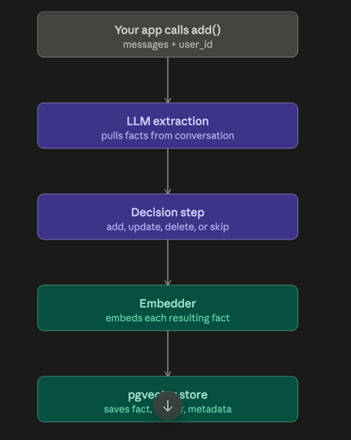

# Summary

## use case
- prefix cache -> provide by LLM Provider
  - system prompt
- Exact match cache [inMemoryandReid](InMemoryAndRedis.md)
  - in Memory
  - Redis
    - Cross Session
```text
Request
   │
   ▼
┌─────────────────────────────┐
│   L1: In-Memory Cache       │  ← Hot queries, sub-ms
│   (last 100-500 requests)   │
└────────────┬────────────────┘
             │ MISS
             ▼
┌─────────────────────────────┐
│   L2: Redis Exact Cache     │  ← Warm queries, ~1ms
│   (TTL: 1h - 24h)           │
└────────────┬────────────────┘
             │ MISS
             ▼
┌─────────────────────────────┐
│   L3: LLM API               │  ← With prefix caching
│   (OpenAI / Anthropic)      │     enabled automatically
└─────────────────────────────┘
```


## mem0 + cache

- mem0: used for long term memory + another layer of caching
  - LLM + Embedding
    - LLM: a smaller model -> semantic search
      - Returns a decision
        - Add / Delete / skip
    - Embedding -> key
      - similar query have before?
  - Use Async save to mem0 [how to save](#add-to-mem0)
  - Mem0 is running locally with config (PGVector or have cloud version)

### add to mem0
- note that metadata is very important
  - used for filter

```text
mem0's search() accepts a filters param that can query on metadata fields (in addition to the required user_id).
E.g. if you tag memories with {"category": "preference"} vs {"category": "order_history"}, you can later search o
nly within one category rather than across everything the user has ever said. Your current search() doesn't pass filters,
so any metadata you're attaching right now is stored but not actually being used to narrow retrieval yet — worth knowing
there's unused capability here.
```
```python
    async def add(self, user_id: str | None, messages: list[dict], metadata: dict | None = None) -> None:
        """Add messages to long-term memory for a user.

        No-op when ``user_id`` is ``None`` (see ``search`` for rationale).
        """
        if user_id is None:
            return
        try:
            memory = await self._get_memory()
            await memory.add(messages, user_id=str(user_id), metadata=metadata)
            logger.info("long_term_memory_updated_successfully", user_id=user_id)
        except Exception as e:
            logger.exception("failed_to_update_long_term_memory", user_id=user_id, error=str(e))
```


### Search
- search take care of the vector search
  - it only use **Embedding** to find top N matches
```python
 memory = await self._get_memory()
# can add filter = to leverage metadata for quicker performance
results = await memory.search(user_id=str(user_id), query=query)
result = "\n".join([f"* {r['memory']}" for r in results["results"]])
```
